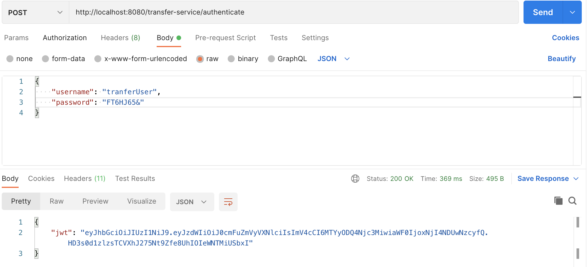
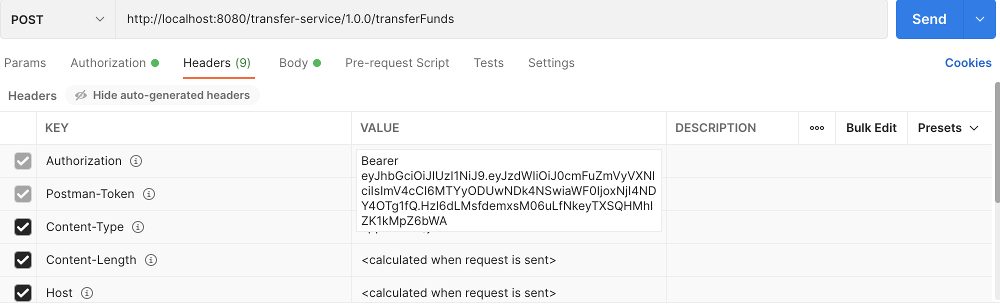
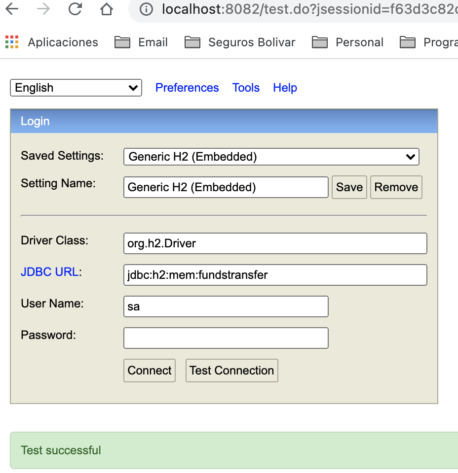
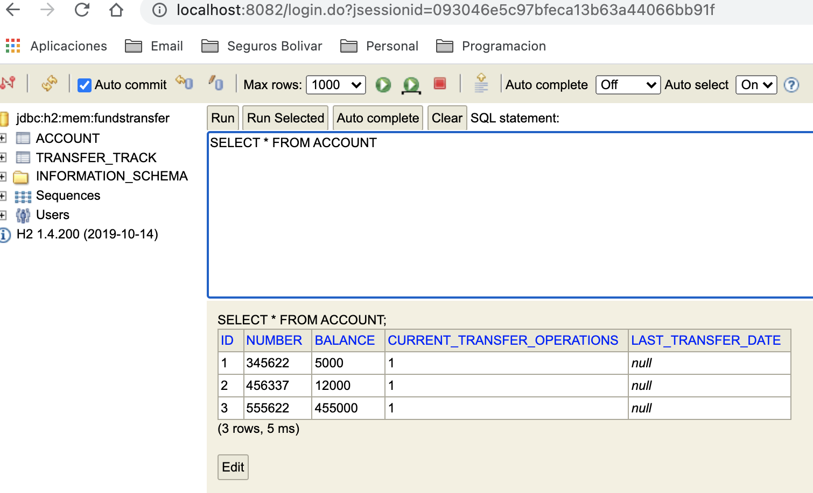
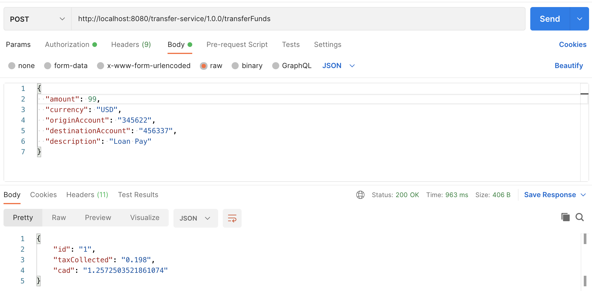
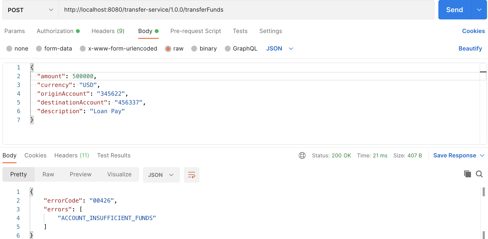
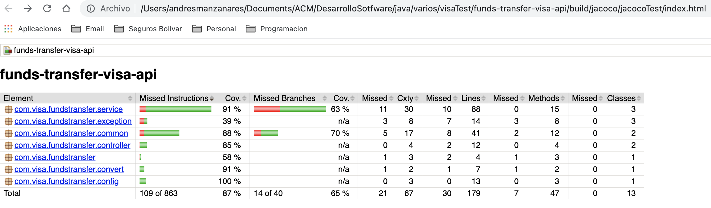

# FUNDS TRANSFER API

Application capable of transferring funds between two savings accounts based on some business rules ([project document](./documentation/Yellow%20Pepper%20Senior%20Java%20Developer%20-%20Take%20Home%20Code%20Challenge.pdf)).

## Setting up the spring project 🚀

* First you need to install java-11
* You need to get and access-key for the currency exchange service (https://exchangeratesapi.io/documentation/)  
* Next you need to configure the following funds-transfer properties ([application.yml](./src/main/resources/application.yml)):

   | NAME | DESCRIPTION | EXAMPLE |
   | --- | --- | :---: |
   | funds-transfer.account.maximum-daily-transfers | maximum number of transfers that can be made in the same day | 3 |
   | funds-transfer.rate-exchange.uri | Third party rate exchange API |  http://api.exchangeratesapi.io/v1/latest |
   | funds-transfer.rate-exchange.access-key | This parameter serves as a unique identifying authentication with the Exchangerates API |  |
   | funds-transfer.rate-exchange.currency.locale | Base currency to which all transactions will be exchanged | CAD |
   | funds-transfer.rate-exchange.currency.exchangeable | comma separated list with all supported currenciesAll of them will be exchanged to the locale one. | USD,COP |
   | funds-transfer.tax.base-amount | Base fund to decide what percentage of tax to apply for transfers | 100.0 |
   | funds-transfer.tax.less-percentage | tax (percentage) that will be applied if the amount of the transfer is less than to the base amount. | 0.2 |
   | funds-transfer.tax.greater-percentage | tax (percentage) that will be applied if the amount of the transfer is greater than the base amount. | 0.5 |

## Commands for gradle/Spring 🔧

- `./gradlew clean build`: Clean the generated build dir
- `./gradlew bootRun`: Download the dependencies & run the application
- `./gradlew test`: Run the project's unit tests

### Running scripts

It was included a couple of wrapper scripts:

- `./compileProjectFundsTransfer.sh` wrapper of ./gradlew clean build
- `./runFundsProjectTransfer.sh` wrapper of ./gradlew bootRun

## Funds Transfer API documentation

Once you run de application, it exposes the [API documentation](http://localhost:8080/transfer-service/swagger-ui.html).

## Security

The REST API use SPRINT SECURITY for all called of resourse or web operations, the contract is the next:
## POST /transfer-service/authenticate
[BodyRequest](./src/main/java/com/visa/fundstransfer/domain/dto/LoginDTO.java):

   | ATTRIBUTE | DESCRIPTION | EXAMPLE |
   | --- | --- | :---: |
   | unsername | (String) user of security API  | transferUser |
   | password | (String) Password of user of security API  | xxxxxx |
   
[Response](./src/main/java/com/visa/fundstransfer/domain/dto/AuthDTO.java):

   | ATTRIBUTE | DESCRIPTION | EXAMPLE |
   | --- | --- | :---: |
   | jwt | (String) user token  | eyJhbGciOiJIUzI1NiJ9.... |

##### NOTE: 
The token should be inclued in the header of the business services, with the key "Authorization" and prefix value "Bearer ". 

The business services return diferent response object like:

## Ok response
[TransferResponseDTO](./src/main/java/com/visa/fundstransfer/domain/dto/TransferResponseDTO.java):

   | ATTRIBUTE | DESCRIPTION | EXAMPLE |
   | --- | --- | :---: |
   | id | (int) identificater of the  transaction | 34562 |
   | taxCollected | (double) Taxes value of the transfer | 0.505 |
   | CAD | (double) Actual value CAD currency  | 1.476778 |
   
## Error response
[ErrorResponseDTO](./src/main/java/com/visa/fundstransfer/domain/dto/ErrorResponseDTO.java):

   | ATTRIBUTE | DESCRIPTION | EXAMPLE |
   | --- | --- | :---: |
   | errorCode | (String) identificater of the  error | 00425 |
   | errors | (String[]) Array error name | ACCOUNT_MAX_DAILY_TRANSFERS_EXCEEDED,ACCOUNT_INSUFFICIENT_FUNDS |

   
* ### Caching:

      Note that it was implemented a cache for the rate exchange service, based on the currency and request date (yyyy-mm-dd).
      The above means that, once system has got a rate exchange for a specific pair of currency and date, rate will be read from cache until it gets a new date.

* ## Error Catalog:
  
- `ACCOUNT_MAX_DAILY_TRANSFERS_EXCEEDED`("Accounts exceeded the number of transfers per day")
- `ACCOUNT_NEGATIVE_BALANCE`("Accounts cannot have negative balances")
- `ACCOUNT_INSUFFICIENT_FUNDS`("Origin Account does not have enough funds")
- `ACCOUNT_NOT_FOUND`("Account was not found")
- `TRANSFER_CURRENCY_NOT_SUPPORTED`("Currency (%s) not supported")
- `TRANSFER_INVALID_AMOUNT`("Transfer amount ($%s) is not valid")
- `GENERAL_ERROR`("Something was wrong")
- `SEVERAL_ERROR`("Something was a critial error")
- `EMPTY_PARAMETERS`("Request parameters is empty")

## Testing ⚙️

It was created data loaders which let you load some data into the database during application starting:

- [CreateModel](./src/main/resources/schema.sql)
- [DataLoader](./src/main/resources/data.sql)

Based on that data execute some testing. For example, you can execute the following:

* Get token service - POST  

* Setting security header

* Get data Account - URL  

 (http://localhost:8082/)

* 

* Transfer - POST - SUCCESS  
  

* Transfer - POST - ERROR  
  

* ### Coverage testing:
      Jacoco is the framework that I used to manage test covegare. (Note: Before should been run the commnad  "./gradlew test" ) 
    
     [JacocoLink](./build/jacoco/jacocoTest/index.html)
  
## Built by using 🛠️

* [Official Gradle documentation](https://docs.gradle.org)
* [Spring Boot Gradle Plugin Reference Guide](https://docs.spring.io/spring-boot/docs/2.5.2/gradle-plugin/reference/html/)
* [Spring Web](https://docs.spring.io/spring-boot/docs/2.5.2/reference/htmlsingle/#boot-features-developing-web-applications)
* [Spring Data JPA](https://docs.spring.io/spring-boot/docs/2.5.2/reference/htmlsingle/#boot-features-jpa-and-spring-data)
* [Spring cache abstraction](https://docs.spring.io/spring-boot/docs/2.5.2/reference/htmlsingle/#boot-features-caching)
* [Third Party Exchange Service](https://exchangeratesapi.io/documentation/)

## Autor ✒️

* **Andres Camelo Manzanares** - *andres.camelo@dreamcodesoft.com*

## Thanks 

* Thank you for taking the time to review this project. Please, feel free to contact me whenever you need.
